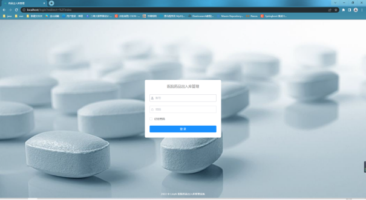
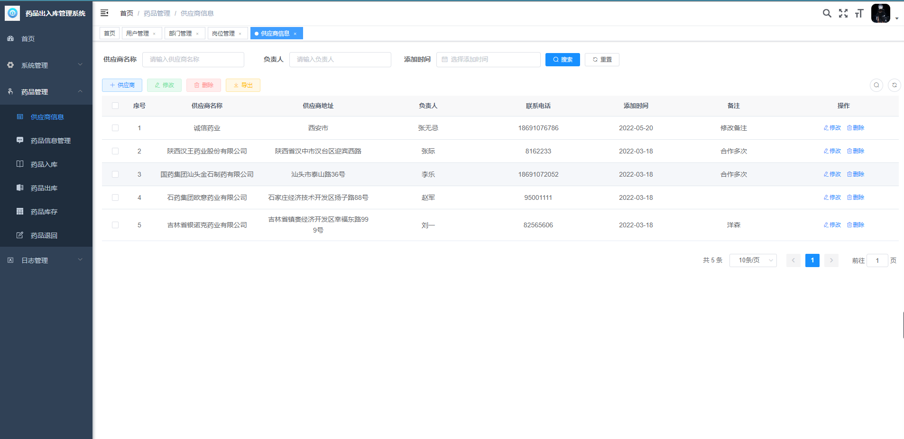
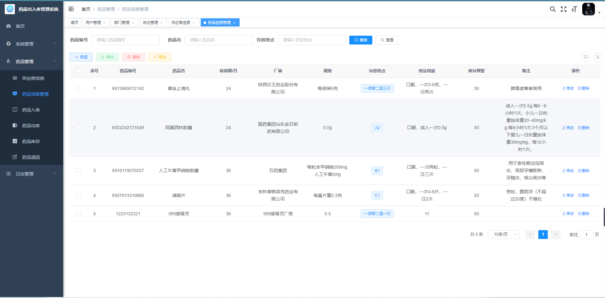
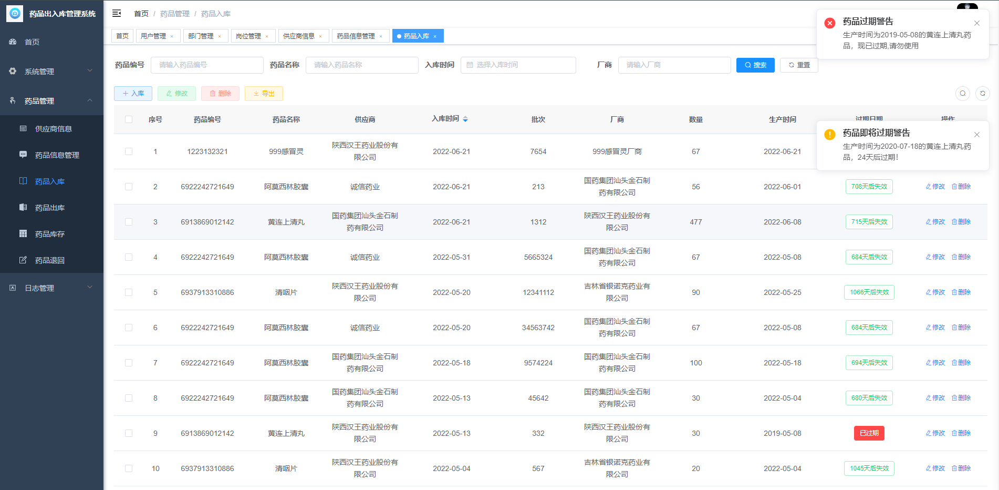
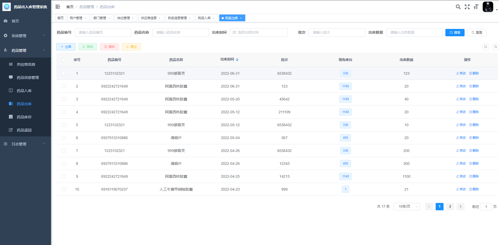
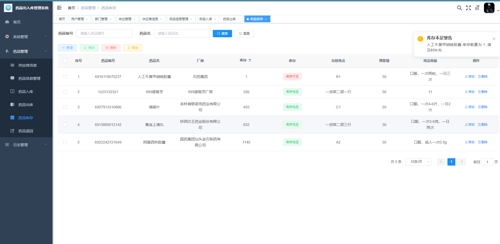
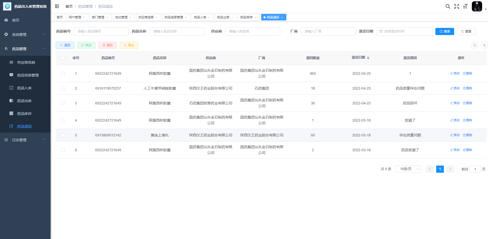

# 医院药品出入库管理系统

#### 介绍
{**以下是 Gitee 平台说明，您可以替换此简介**
Gitee 是 OSCHINA 推出的基于 Git 的代码托管平台（同时支持 SVN）。专为开发者提供稳定、高效、安全的云端软件开发协作平台
无论是个人、团队、或是企业，都能够用 Gitee 实现代码托管、项目管理、协作开发。企业项目请看 [https://gitee.com/enterprises](https://gitee.com/enterprises)}

#### 软件架构
软件架构说明

#### 系统环境版本说明
JDK >= 1.8 
Mysql >= 5.7.0
Redis >= 3.0
Maven >= 3.0
Node >= 12

#### 使用说明

1、后端运行：

(1)将项目导入到IntelliJ IDEA中

(2)创建数据库ly，并执行ly.sql数据脚本

(3)修改数据库连接，编辑resources目录下的application-druid.yml，将数据库账号密码改为自己本地的

(4)配置redis编辑resources目录下的application.yml，可配置redis（默认无密码）

(5)启动redis后，再启动RuoYiApplication.java类即可运行系统。

2、前端运行：

(1)cd ruoyi-ui

(2)使用npm install安装依赖（不建议通过cnpm或其它进行安装 可能会丢包）

(3)在终端使用npm run dev来启动项目

#### 特技

1.  使用 Readme\_XXX.md 来支持不同的语言，例如 Readme\_en.md, Readme\_zh.md
2.  Gitee 官方博客 [blog.gitee.com](https://blog.gitee.com)
3.  你可以 [https://gitee.com/explore](https://gitee.com/explore) 这个地址来了解 Gitee 上的优秀开源项目
4.  [GVP](https://gitee.com/gvp) 全称是 Gitee 最有价值开源项目，是综合评定出的优秀开源项目
5.  Gitee 官方提供的使用手册 [https://gitee.com/help](https://gitee.com/help)
6.  Gitee 封面人物是一档用来展示 Gitee 会员风采的栏目 [https://gitee.com/gitee-stars/](https://gitee.com/gitee-stars/)

#### 系统演示

1.  登录（验证码功能已关闭，可参考若依开启验证码功能）。超级管理员： admin admin123 普通管理员：ry admin123

2.  首页

3.  药品管理

  1） 药品供应商管理  

  

  2） 药品信息管理

  3） 药品入库管理

  4） 药品出库管理

  5） 药品库存管理

  6） 药品回退管理

4.  系统管理和日志管理模块为[若依系统](http://www.ruoyi.vip/)模块。
