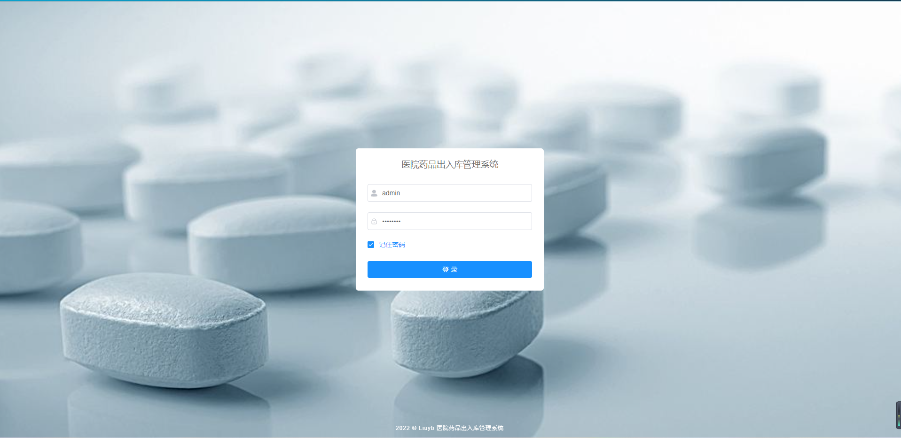

# 医院药品出入库管理系统

#### 介绍
系统主要实现了供应商信息和药品信息的增、删、改、查的基本信息管理功能，以及药品入库、出库、退回和库存的管理功能，其中 药品入库时能实时的展示药品到期时间及对即将要过期和已过期药品进行系统 警告提示。

#### 系统环境版本说明
JDK >= 1.8 
Mysql >= 5.7.0
Redis >= 3.0
Maven >= 3.0
Node >= 12

#### 使用说明

1、后端运行：

(1)将项目导入到IntelliJ IDEA中

(2)创建数据库ly，并执行ly.sql数据脚本

(3)修改数据库连接，编辑resources目录下的application-druid.yml，将数据库账号密码改为自己本地的

(4)配置redis编辑resources目录下的application.yml，可配置redis（默认无密码）

(5)启动redis后，再启动RuoYiApplication.java类即可运行系统。

2、前端运行：

(1)cd ruoyi-ui

(2)使用npm install安装依赖（不建议通过cnpm或其它进行安装 可能会丢包）

(3)在终端使用npm run dev来启动项目

#### 系统演示

1.  登录（验证码功能已关闭，可参考若依开启验证码功能）。

超级管理员： admin admin123 普通管理员：ry admin123

2.  首页

3.  药品管理

  1） 药品供应商管理  

  2） 药品信息管理

  3） 药品入库管理

  4） 药品出库管理

  5） 药品库存管理

  6） 药品回退管理

4.  系统管理和日志管理模块为[若依系统](http://www.ruoyi.vip/)模块。
